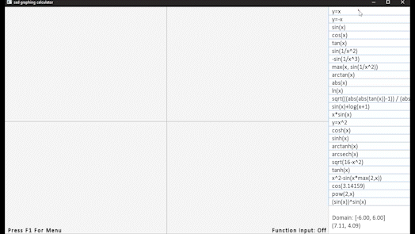
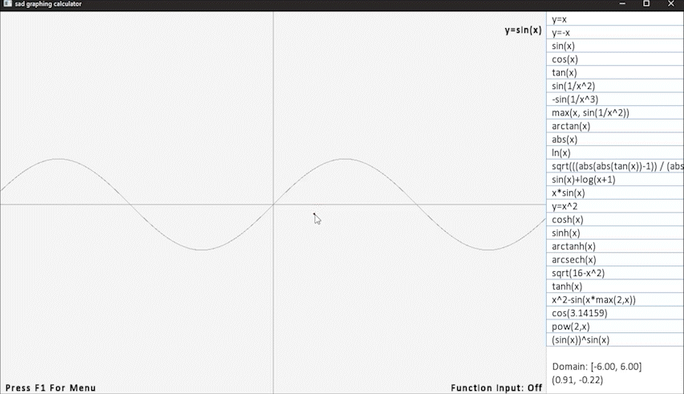
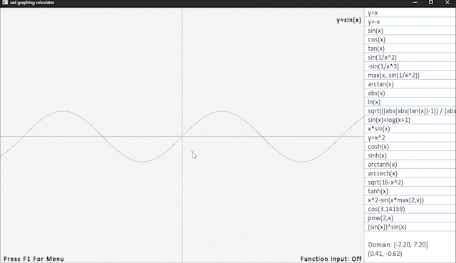
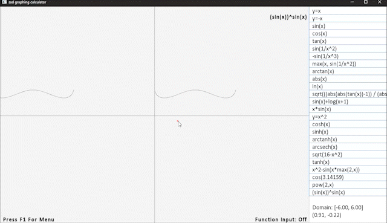

# Graphing Calculator
A fun little project built with the help of [SFML Version 2.5.1](https://www.sfml-dev.org/download/sfml/2.5.1/).

## Features
  - Sidebar: Store and save functions for easy access.
  - Zoom: Zoom in and out of the graph using the scroll wheel.
  - Pan: Navigate the graph using arrow keys.
  - User Input: Enter custom functions to experiment and analyze specific equations.

|||
|---|---|
|||

### Controls
- Open Menu: F1
- Close Menu: F1 or Esc
- Enter Function Input Mode: Enter or F
- Exit Function Input Mode: Enter or Esc
- Select Function from Sidebar: Left-click on the function box in the sidebar
- Save Function to Sidebar: Right-click on the desired function box in the sidebar
- Zoom In/Out: Scroll up / Scroll down
- Pan: Arrow keys
- Reset Domain: R
- Save Functions to File: S (while in the menu)
- Load Functions from File: L (while in the menu)

## Building

Prior to installation, ensure that you have downloaded [SFML Version 2.5.1](https://www.sfml-dev.org/download/sfml/2.5.1/). In the provided makefile, modify the variables ``PATH_TO_SFML_HEADERS`` and ``PATH_TO_SFML_LIBS`` to accurately reflect the location of SFML headers and libraries on your system. Then, execute the following commands from the project's root directory to compile:

- Run ``make``
- Change directory to ``build`` using the command ``cd build``
- Launch the executable ``main`` by executing ``./main``